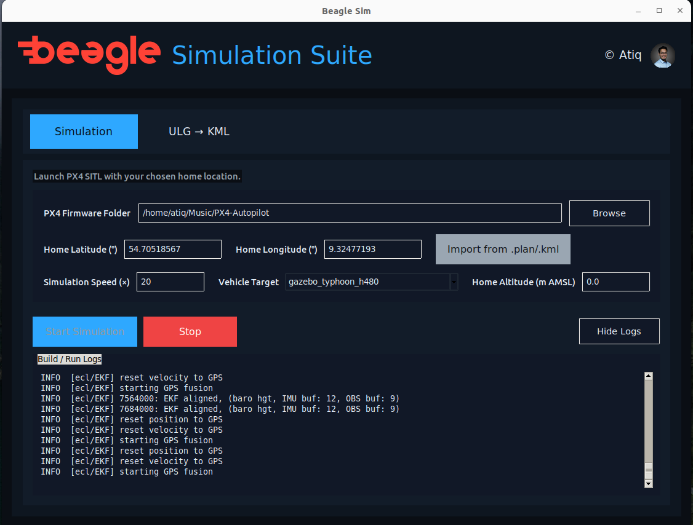

# px4-simulation-configurator
PX4 Software-in-the-Loop (SITL) GUI Launcher with log analysis and configuration persistence.
<p align="center">
  
</p>

<p align="center">
  A robust GUI wrapper for launching and managing PX4 SITL simulations with one click.
</p>

<p align="center">
  
  
  
</p>

---

The **PX4 Simulation Configurator (Beagle Sim)** is a powerful desktop application for Ubuntu that eliminates the complexity of running PX4 Software-in-the-Loop (SITL) simulations. It provides a clean, user-friendly interface to manage all critical launch parameters, view logs in real-time, and convert flight logs for analysis.

## 📸 Screenshot



## ✨ Core Features

* **One-Click Simulation Launch:** Start and stop `make px4_sitl_default <vehicle>` processes directly from the GUI.
* **Automatic Environment Setup:** Automatically sources the correct `bash` profiles and sets all required environment variables (`PX4_HOME_LAT`, `LIBGL_ALWAYS_SOFTWARE`, etc.) for a headless Gazebo launch.
* **Persistent Configuration:** Remembers your PX4 directory, coordinates, simulation speed, and vehicle choice. It even remembers the last folders you used for file browsing.
* **Real-time Log Viewer:** A built-in console displays the simulation's build and runtime output, with color-coding for `[LAUNCH]`, `[INFO]`, and `[ERROR]` messages.
* **Built-in ULG to KML Converter:** A dedicated tab to quickly convert binary `.ulg` flight logs into `.kml` files for analysis in Google Earth.
* **Robust Fallback Support:** If the standard `ulog2kml` tool fails, the app uses a built-in Python fallback converter to ensure your KML is always generated.
* **Native Desktop Experience:** Uses native Linux file dialogs (Zenity), a sleek dark-mode theme, and distinct, high-volume sound effects for clear user feedback.
* **Online Authorization:** This application requires an active internet connection to run. On startup, it securely fetches the core launch script from a remote server to ensure authorized use.

## 🚀 Getting Started

This application is designed for Ubuntu/Debian-based systems.

### 1. System Dependencies

Before installing, ensure you have the core system dependencies required for the GUI and its features.

```bash
sudo apt-get update
sudo apt-get install -y python3 python3-tk python3-pip zenity libcanberra-gtk3-module pulseaudio-utils
```

*(Note: The application will also attempt to auto-install required Python packages like `pyulog`, `simplekml`, and `Pillow` on first use.)* 

### 2. Clone the Repository

Clone this repository to your local machine.

```bash
# ⚠️ Replace YOUR_USERNAME with your GitHub username
git clone [https://github.com/YOUR_USERNAME/px4-simulation-configurator.git](https://github.com/YOUR_USERNAME/px4-simulation-configurator.git)
cd px4-simulation-configurator 
```

### 3. Run the Installer

Make the setup script executable and run it. This will create a desktop icon and an application menu entry for "Sim".

```bash
chmod +x setup_sim_once.sh
./setup_sim_once.sh
```
After running, you can launch "Sim" from your applications menu or the new icon on your Desktop. If the icon appears as "Untrusted," right-click it and select "Allow Launching."

## Workflow: From Plan to Analysis

Here is a typical workflow for planning a mission, simulating it, and reviewing the flight log.

### Step 1: Set Up the Simulation

1.  Go to the **Simulation** tab in the *PX4 Simulation Configurator*.
2.  Click **Import from .plan/.kml** and select your QGroundControl `.plan` or Google Earth `.kml` file.
3.  The **Home Latitude, Longitude, and Altitude** fields will automatically fill using the file's home position or first waypoint.
4.  Select your **PX4 Firmware Folder** (the app will remember this for next time).
5.  Choose your desired **Vehicle Target** and **Simulation Speed**.
6.  Click **Start Simulation**.
7.  Wait for the log window to show that the simulation is running and waiting for a connection (e.g., `INFO  [mavlink] Waiting for connection on UDP port 14550...`).

### Step 2: Connect QGroundControl

1.  Open **QGroundControl**.
2.  It should automatically detect and connect to the simulation via the default **UDP Comm Link**.
3.  If it does not connect, go to **Application Settings > Comm Links** and manually add a new **UDP** link on **Port 14550**.

### Step 3: Fly the Mission

1.  In QGroundControl, go to the **Plan View**.
2.  Open the **exact same `.plan` file** you used in Step 1.
3.  Upload the mission to the (simulated) vehicle.
4.  Start the mission from the **Fly View**. The simulated drone in Gazebo will now fly your planned route.

### Step 4: Analyze the Flight Log

1.  Once your mission is complete, click the **Stop** button in the *PX4 Simulation Configurator*.
2.  Go to the **ULG → KML** tab.
3.  Click **Browse** and select the `.ulg` flight log you want to analyze. (These are usually in your `.../PX4-Autopilot/build/px4_sitl_default/logs` directory).
4.  Click **Convert ULG → KML** to generate a visual flight path for review in Google Earth.

